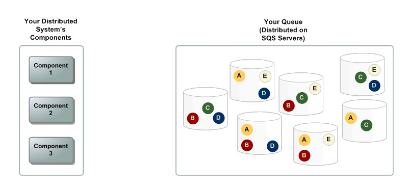
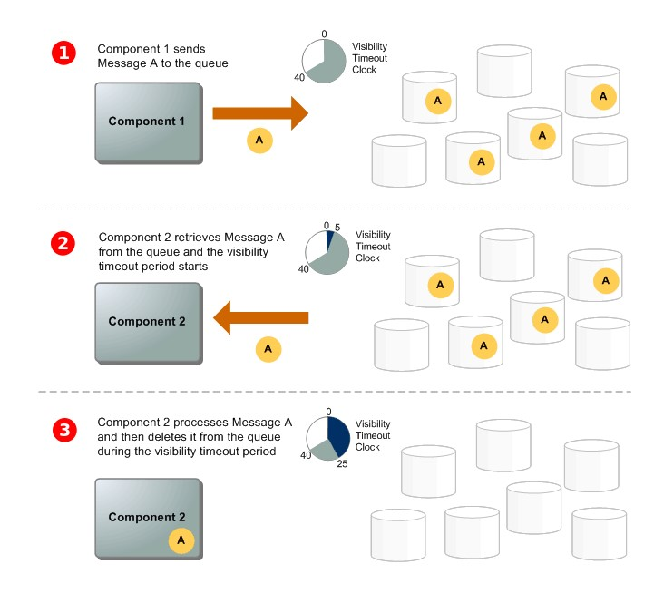
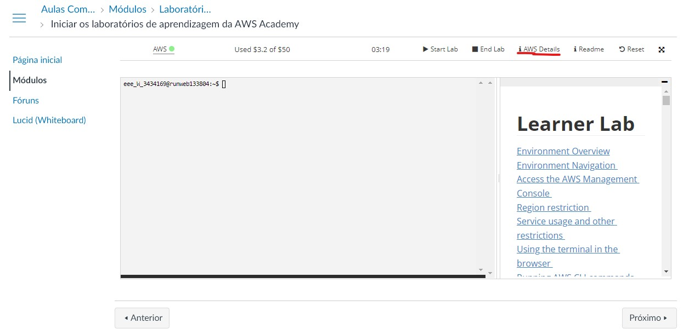
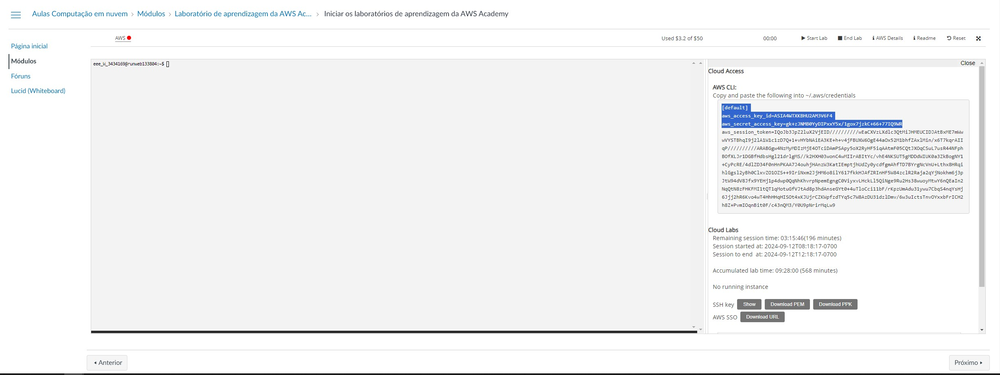

# Amazon Simple Queue Service

- O Amazon Simple Queue Service (Amazon SQS) oferece uma fila hospedada segura, durável e disponível que permite integrar e desacoplar sistemas de software e componentes distribuídos.

- O Amazon SQS oferece constructos comuns, como filas de mensagens mortas e tags de alocação de custos.

- Ele fornece uma API genérica de serviços da Web que você pode acessar usando qualquer linguagem de programação compatível com o AWS SDK.

    ## Benefícios

    - Segurança

    - Durabilidade

    - Escalabilidade

    - Confiabilidade

    - Personalização

    ## Arquitetura básica do Amazon SQS

    ### Filas distribuídas 

    - Há três partes principais em um sistema de mensagens distribuído: os componentes do sistema distribuído, a fila (distribuída em servidores do Amazon SQS) e as mensagens na fila.

    

    ### Ciclo de vida de mensagens

    - O cenário a seguir descreve o ciclo de vida de uma mensagem do Amazon SQS em uma fila, da criação à exclusão.

    

    1. Um produtor (componente 1) envia a mensagem A para uma fila, e a mensagem é distribuída pelos servidores do Amazon SQS de forma redundante.

    2. Quando um consumidor (componente 2) está pronto para processar mensagens, ele consume as mensagens da fila, e a mensagem A é devolvida. Enquanto a mensagem A está sendo processada, ela permanece na fila e não é devolvida para as solicitações de recebimento subsequentes durante todo o tempo limite de visibilidade.

    3. O consumidor (componente 2) exclui a mensagem A da fila para impedir que a mensagem seja recebida e processada novamente quando o tempo limite de visibilidade for esgotado.

    ## Processo de criação de filas

    - Pesquise em serviço por sqs, uma lista com todas as filas que você possui irá aparecer e provavelmente estará vazia, clique em "Criar fila".

    - AWS fornece duas opções de fila: Padrão e FIFO.

        - Padrão: As filas padrão suportam um número quase ilimitado de chamadas de API por segundo para ações como SendMessage, e. ReceiveMessageDeleteMessage As filas padrão garantem a entrega de at-least-once mensagens, mas devido à arquitetura altamente distribuída, mais de uma cópia de uma mensagem pode ser entregue e, ocasionalmente, as mensagens podem chegar fora de ordem. Apesar disso, as filas padrão fazem o possível para manter a ordem em que as mensagens são enviadas.

        - FIFO: As filas FIFO (primeiro a entrar, primeiro a sair) têm todos os recursos das filas comuns, mas são projetadas para aprimorar o sistema de mensagens entre aplicações quando a ordem das operações e dos eventos é crucial ou quando duplicatas não podem ser toleradas.

    - Escolha o tipo de fila e um nome para sua fila

    - Após escolher o tipo de fila é possível configurar o tempo de limite de visibilidade, período de retenção da mensagem, criptografia, políticas de acesso, a utilização da fila como fila de mensagens mortas, entre diversas coisas, essas configurações podem ser alteradas após a criação da fila.

        **Observação: O tipo de fila não pode ser alterado após sua criação**

    - Após feita as configurações desejadas, clique em "Criar fila".

    - Clicando na aba a esquerda, clique em "Filas", você verá sua fila criado

    - Ao clicar nela é possível ver várias opções, para editar a fila, excluir a fila, limpar as mensagens e enviar e receber mensagens.

    - É possível fazer um monitoramento das filas, configura-la como fila de mensagens mortas, pode integra-la a uma Lambda, assim como também ao Amazon SNS.

    ## Demonstração do uso da fila

    - As filas da Amazon SQS podem ser integradas de diversas formas, usando a Lambda com mencionada antes, utilizando a própria API da Amazon, assim como o AWS SDK. Devido as restrições do AWS academy foi escolhida o AWS SDK como maneira mais simples de demonstrar. O AWS SDK suporta diversas linguagens, a escolhida para essa demonstração foi a linguagem Python.

    ### Pré - requisito

    - Instalar o Pyhton no ambiente de sua escolha

    ### Passo a passo

1. Instalar o Boto3
    ````
    pip install boto3
    ````
2. Configurar credenciais AWS: As credenciais (chave de acesso e chave secreta) precisam estar configuradas para que o Boto3 possa autenticar suas requisições com o AWS.
    
        2.1. Crie um arquivo na raiz no seu projeto **/.aws/credentials**
        
        2.2. Adicione o seguinte texto no arquivo credentials
        ````
        [default]
        aws_access_key_id = YOUR_ACCESS_KEY
        aws_secret_access_key = YOUR_SECRET_KEY
        ````
        **Observação:**
        - Para encontrar suas credenciais AWS, no página do laboratório AWS clique em "iAWS Details"

        

        - Ao lado AWS CLI clique em "Show"

        - Copie os seguintes dados e adicione ao seu arquivo credentials

        

        - Sempre que o Lab é reiniciado as suas credenciais AWS são alteradas, será necessário alterá-las.

3. Crie um arquivo chamado Producer.py
    ````
    import boto3

    # Criar uma sessão no boto3
    sqs = boto3.client('sqs')

    # URL da fila do SQS
    queue_url = 'https://sqs.REGION.amazonaws.com/ACCOUNT_ID/QUEUE_NAME'

    # Mensagem a ser enviada
    message = 'Olá, esta é uma mensagem para o SQS!'

    # Enviar a mensagem
    response = sqs.send_message(
        QueueUrl=queue_url,
        MessageBody=message
    )

    print(f'Mensagem enviada com ID: {response["MessageId"]}')
    ````

4. Crie um arquivo chamado Consumer.py
    ````
    import boto3

    # Criar uma sessão no boto3
    sqs = boto3.client('sqs')

    # URL da fila do SQS
    queue_url = 'https://sqs.REGION.amazonaws.com/ACCOUNT_ID/QUEUE_NAME'

    # Receber a mensagem
    response = sqs.receive_message(
        QueueUrl=queue_url,
        MaxNumberOfMessages=1,  # Quantas mensagens você deseja receber de uma vez
        WaitTimeSeconds=10      # Esperar por até 10 segundos por uma mensagem
    )

    messages = response.get('Messages', [])
    if messages:
        for message in messages:
            print(f'Mensagem recebida: {message["Body"]}')
            # Exclua a mensagem após processá-la para que não seja lida novamente
            receipt_handle = message['ReceiptHandle']
            sqs.delete_message(QueueUrl=queue_url, ReceiptHandle=receipt_handle)
            print('Mensagem excluída da fila.')
    else:
        print('Nenhuma mensagem recebida.')
    ````

    **Observação:**

    - A queue_url é encontrada na fila que você acabou de criar.

5. Agora basta executar o arquivo Producer.py e Consumer.py. Será possível ver as mensagens criada pelo Producer.py na lista de mensagens da fila criada na AWS e sempre que executar o Consumer.py a fila será deletada.


